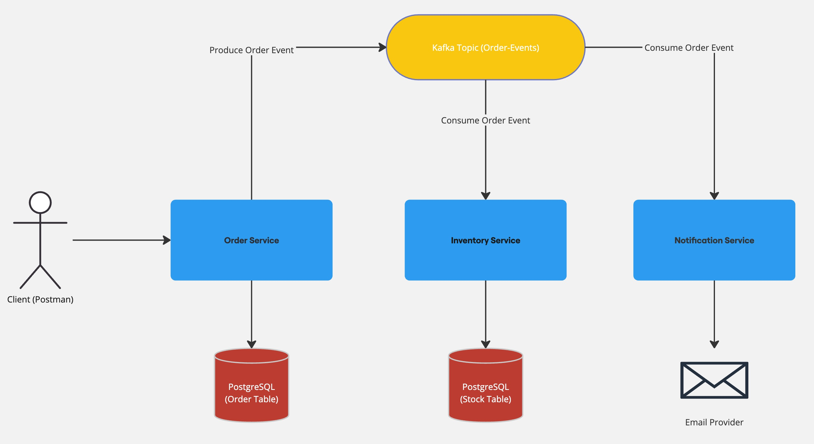
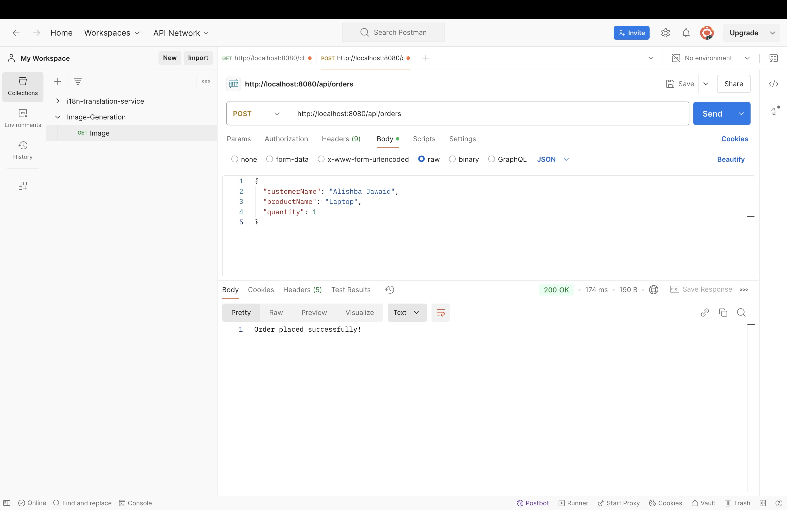
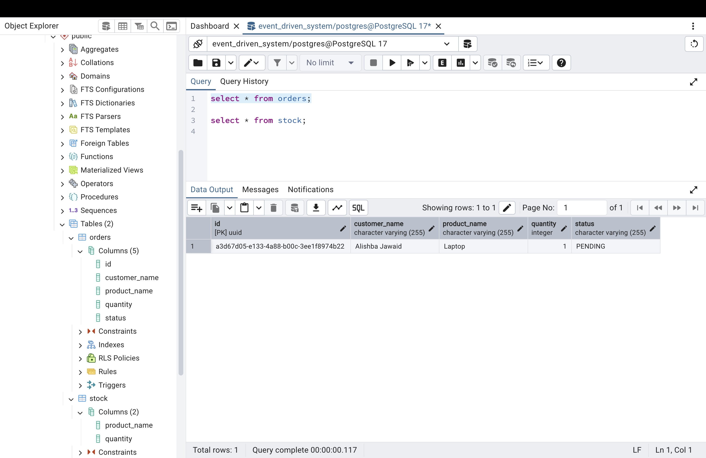
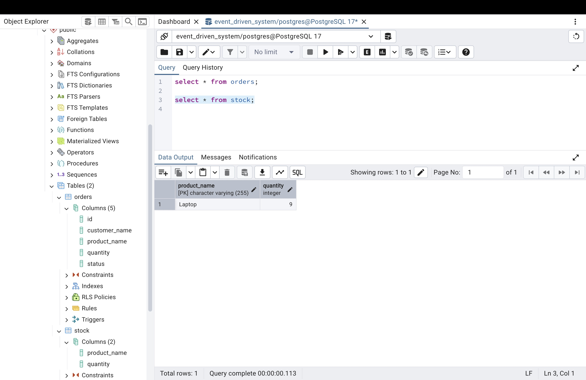
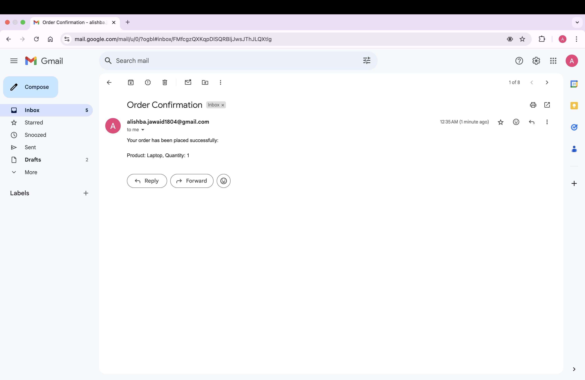

# Event-Driven Microservices System

This project demonstrates an event-driven microservices architecture using Spring Boot, Apache Kafka, PostgreSQL, and Docker. It consists of the following services:

- **Order Service**: Handles order placements.
- **Inventory Service**: Manages stock updates.
- **Notification Service**: Sends email notifications for placed orders.

## Features

- Event-driven architecture using Kafka.
- Seamless integration between multiple microservices.
- Real-time inventory stock updates.
- Email notifications for order confirmations.
- PostgreSQL for persistent storage.
- Docker for containerized setup.

## Architecture Overview



### Workflow
1. **Order Placement**:
    - User places an order via the `Order Service`.
    - The service publishes an `order-placed` event to Kafka.

2. **Stock Update**:
    - The `Inventory Service` consumes the `order-placed` event.
    - Updates the stock in the PostgreSQL database.

3. **Notification**:
    - The `Notification Service` listens to the event.
    - Sends an email notification to the user.

## Tech Stack

- **Java**: Programming language.
- **Spring Boot**: Framework for building microservices.
- **Apache Kafka**: Event streaming platform.
- **PostgreSQL**: Database for persistent storage.
- **Docker**: Containerization platform.
- **Java Mail API**: For sending email notifications.

## Prerequisites

- **JDK**: Version 17 or above.
- **Maven**: For building the project.
- **Docker & Docker Compose**: For running Kafka and PostgreSQL.

## Setup Instructions

### 1. Clone the Repository
```bash
git clone <repository-url>
cd event-driven-microservices-system
```

### 2. Start Kafka and PostgreSQL
```bash
docker-compose up -d
```

### 3. Configure the Application

- Update your PostgreSQL credentials in `src/main/resources/application.properties`.
- Set up your email credentials securely in `application.properties`:

```properties
spring.mail.host=smtp.gmail.com
spring.mail.port=587
spring.mail.username=${EMAIL_USERNAME}
spring.mail.password=${EMAIL_PASSWORD}
```

Store the email credentials in a secure `.env` file:
```bash
EMAIL_USERNAME=your_email@gmail.com
EMAIL_PASSWORD=your_app_password
```

### 4. Run the Application

```bash
mvn spring-boot:run
```

### 5. Place an Order
Use Postman or any API testing tool to test the `/api/orders` endpoint:

- **Endpoint**: `POST http://localhost:8080/api/orders`
- **Request Body**:
```json
{
  "customerName": "Alishba Jawaid",
  "productName": "Laptop",
  "quantity": 1
}
```
- **Response**:
```json
{
  "message": "Order placed successfully!"
}
```

## Database Schema

### Orders Table
| Column         | Type          |
|----------------|---------------|
| `id`           | UUID          |
| `customer_name`| VARCHAR(255)  |
| `product_name` | VARCHAR(255)  |
| `quantity`     | INTEGER       |
| `status`       | VARCHAR(255)  |

### Stock Table
| Column         | Type          |
|----------------|---------------|
| `product_name` | VARCHAR(255)  |
| `quantity`     | INTEGER       |

## Screenshots

### Order Placement in Postman


### Database State After Order
#### Orders Table


#### Stock Table


### Email Notification


## Future Enhancements

- **Payment Integration**: Add a payment gateway for order payments.
- **Monitoring**: Use Prometheus and Grafana for monitoring.
- **Unit Testing**: Write comprehensive unit and integration tests.
- **Cloud Deployment**: Deploy services on AWS or Azure.

## Contributing

Contributions are welcome! Please fork the repository and create a pull request for any enhancements or bug fixes.