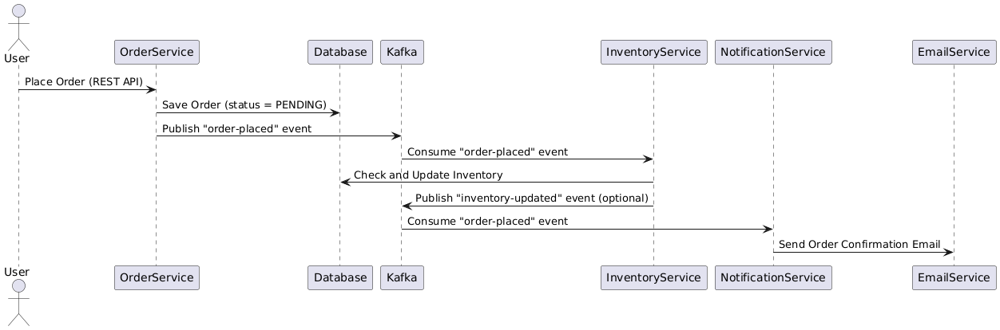

# Hệ thống Đặt Hàng và Cập Nhật Tồn Kho

## 1. Domain
**Mục đích**: Chứa các lớp mô hình (entities) và các interface repository để định nghĩa các hành vi của domain.

### Các thành phần:
#### Model:
- **Order**: Đại diện cho đơn hàng với các thuộc tính như `id`, `customerName`, `productName`, `quantity`, và `status`.
- **Stock**: Đại diện cho tồn kho với các thuộc tính `productName` và `quantity`.

#### Repository:
- **OrderRepository**: Interface định nghĩa các hành vi lưu trữ và truy xuất đơn hàng.
- **StockRepository**: Interface định nghĩa các hành vi lưu trữ và truy xuất tồn kho.

## 2. Application
**Mục đích**: Chứa các lớp xử lý logic nghiệp vụ (services) và các cổng giao tiếp (ports).

### Các thành phần:
#### Service:
- **OrderService**: Xử lý logic đặt hàng, lưu đơn hàng và phát sự kiện `order-placed` lên Kafka.
- **InventoryService**: Lắng nghe sự kiện `order-placed`, cập nhật tồn kho.
- **NotificationService**: Lắng nghe sự kiện `order-placed`, gửi email xác nhận đơn hàng.

#### Ports:
- **OrderServicePort**: Định nghĩa cổng giao tiếp cho `OrderService`.

## 3. Infrastructure
**Mục đích**: Chứa các lớp liên quan đến giao tiếp bên ngoài (Kafka, REST API) và các adapter để kết nối với cơ sở dữ liệu.

### Các thành phần:
#### Controller:
- **OrderController**: Xử lý các yêu cầu REST API liên quan đến đặt hàng.
- **KafkaController**: Gửi thông điệp Kafka qua API.

#### Kafka:
- **KafkaProducerService**: Gửi thông điệp lên Kafka.
- **KafkaConsumerService**: Lắng nghe thông điệp từ Kafka.

#### Persistence:
- **OrderJpaAdapter**: Adapter để lưu và truy xuất đơn hàng từ cơ sở dữ liệu.
- **OrderJpaRepository**: Repository JPA cho `Order`.

## Workflow Chi Tiết

### 1. Đặt hàng
- Người dùng gửi yêu cầu đặt hàng qua API `/api/orders` (được xử lý bởi `OrderController`).
- `OrderController` gọi `OrderService` để:
  - Tạo một đối tượng `Order` với trạng thái `PENDING`.
  - Lưu đơn hàng vào cơ sở dữ liệu thông qua `OrderJpaAdapter`.
  - Phát sự kiện `order-placed` lên Kafka qua `KafkaTemplate`.

### 2. Cập nhật tồn kho
- `InventoryService` lắng nghe sự kiện `order-placed` từ Kafka.
- Khi nhận được sự kiện:
  - Trích xuất thông tin sản phẩm và số lượng từ thông điệp Kafka.
  - Kiểm tra tồn kho trong cơ sở dữ liệu qua `StockRepository`.
  - Cập nhật số lượng tồn kho và lưu lại thay đổi.

### 3. Gửi thông báo
- `NotificationService` lắng nghe sự kiện `order-placed` từ Kafka.
- Khi nhận được sự kiện:
  - Trích xuất email khách hàng và thông tin đơn hàng từ thông điệp Kafka.
  - Gửi email xác nhận đơn hàng qua `JavaMailSender`.

## Tóm tắt
- **Cấu trúc**: Hệ thống được tổ chức theo kiến trúc phân lớp với các package `domain`, `application`, và `infrastructure`.
- **Workflow**: Gồm ba bước chính:
  - Đặt hàng (REST API -> Kafka).
  - Cập nhật tồn kho (Kafka -> PostgreSQL).
  - Gửi thông báo (Kafka -> Email).
- **Công nghệ**: Spring Boot, Apache Kafka, PostgreSQL, JavaMailSender.
